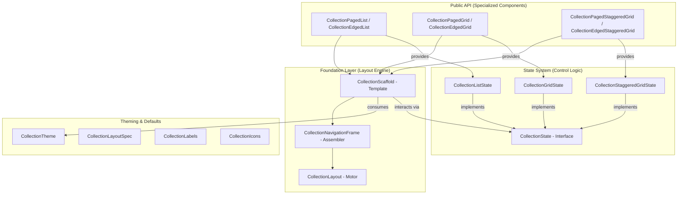

# API Blueprint & Technical Map

This document provides a comprehensive mapping of the `ComposeCollections` library, showing the relationships between its components, states, and internal engine.

## 1. Architectural Hierarchy (Visual)

The library follows a strict layered approach to ensure consistency and reuse.

---

## 2. Functional Matrix

This table shows which features are available across the public components.

| Component | Orientation (V/H) | Progress Indicator | Animation Presets | Hardware Shortcuts | Sticky Headers |
| :--- | :---: | :---: | :---: | :---: | :---: |
| **CollectionPagedList** | ✅ | ✅ | ✅ | ✅ | ✅ |
| **CollectionEdgedList** | ✅ | ✅ | ✅ | ✅ | ✅ |
| **CollectionPagedGrid** | ✅ | ✅ | ✅ | ✅ | ✅ |
| **CollectionEdgedGrid** | ✅ | ✅ | ✅ | ✅ | ✅ |
| **CollectionPagedStaggeredGrid** | ✅ | ✅ | ✅ | ✅ | ✅ |
| **CollectionEdgedStaggeredGrid** | ✅ | ✅ | ✅ | ✅ | ✅ |

---

## 3. Package Taxonomy & Responsibilities

### `.collections.layout.foundation`
- **Goal**: Structural integrity and input orchestration.
- **Key Files**: 
    - `CollectionLayout`: Atomic placement of content and slots.
    - `CollectionScaffold`: High-level orchestration, theme injection, and **hardware key event mapping**.
- **Dependency**: Depends on `CollectionTheme`, `CollectionState`, and `internal` routing.

### `.collections.state`
- **Goal**: Behavioral logic and scroll control.
- **Key Files**: `CollectionState` (The Contract), and concrete implementations for List, Grid, and Staggered.
- **Design Pattern**: **State Hoisting**. Decouples "when to show buttons" and "how to move" from the UI.

### `.collections.internal`
- **Goal**: Encapsulation (The "Kitchen").
- **Responsibilities**: Routing buttons (`CollectionRouter`), icon resolution, and low-level panel assembly.
- **Access**: Marked as `internal`. Not visible to library consumers.

### `.collections.defaults`
- **Goal**: Global configuration and presets.
- **Key Files**: 
    - `CollectionLayout.kt`: Navigation alignments and behavior modes (`Edged`, `Paged`).
    - `CollectionAnimation.kt`: Animation modes (`Snap`, `Elastic`) and physics presets.
    - `CollectionVisibilityTransitions.kt`: Visibility transitions (`fadeIn`, `fadeOut`).
    - `CollectionTheme.kt`: Main theming engine and `CompositionLocal` providers.
    - `CollectionLabelDefaults.kt`: Default localized strings and test tags.

---

## 4. Key Data Relationships

- **CollectionTheme -> UI**: Provides colors, icons, and labels via `CompositionLocal`.
- **CollectionState -> Scaffold**: 
    - The Scaffold consumes the entire `CollectionState` object to manage visibility and navigation.
    - On user clicks or **hardware key events** (`PageUp/Down`, `Home/End`), the Scaffold triggers the corresponding `animateScrollTo...` methods.
- **CollectionLayoutSpec -> LazyContainer**: Controls whether the content is a `LazyColumn`, `LazyRow`, or a `Grid` variant.

---

## 5. Extensibility Map

If you want to customize the library, here is where you should look:

1. **Visual Customization**: Use `CollectionTheme` in the `.defaults` package.
2. **New Container Support**: Use `CollectionScaffold` in the `.foundation` package.
3. **Custom Navigation Logic**: Implement `CollectionState` in the `.state` package.
