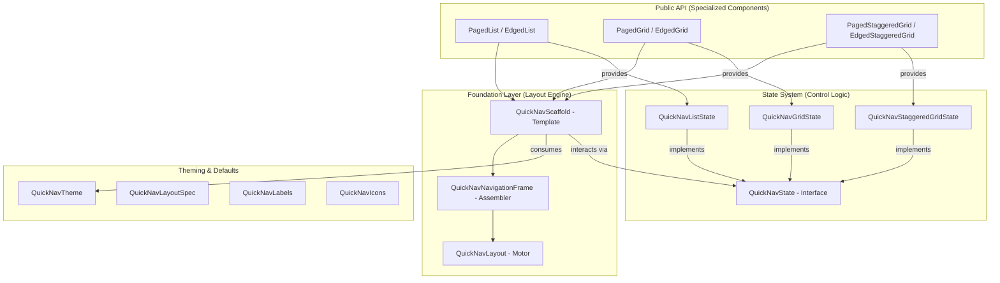

# API Blueprint & Technical Map

This document provides a comprehensive mapping of the `ComposeCollections` library, showing the relationships between its components, states, and internal engine.

## 1. Architectural Hierarchy (Visual)

The library follows a strict layered approach to ensure consistency and reuse.

---

## 2. Functional Matrix

This table shows which features are available across the public components.

| Component | Orientation (V/H) | Progress Indicator | Animation Presets | Sticky Headers |
| :--- | :---: | :---: | :---: | :---: |
| **PagedList** | ✅ | ✅ | ✅ | ✅ |
| **EdgedList** | ✅ | ✅ | ✅ | ✅ |
| **PagedGrid** | ✅ | ✅ | ✅ | ❌ (Compose restriction) |
| **EdgedGrid** | ✅ | ✅ | ✅ | ❌ (Compose restriction) |
| **PagedStaggeredGrid** | ✅ | ✅ | ✅ | ❌ (Compose restriction) |
| **EdgedStaggeredGrid** | ✅ | ✅ | ✅ | ❌ (Compose restriction) |

---

## 3. Package Taxonomy & Responsibilities

### `.scrollables.layout.foundation`
- **Goal**: Structural integrity.
- **Key Files**: `QuickNavLayout` (Atomic placement), `QuickNavScaffold` (High-level orchestration).
- **Dependency**: Depends only on `QuickNavTheme` and `QuickNavState`.

### `.scrollables.state`
- **Goal**: Behavioral logic.
- **Key Files**: `QuickNavState` (The Contract), and concrete implementations for List, Grid, and Staggered.
- **Design Pattern**: **State Hoisting**. Decouples "when to show buttons" from "how to draw them".

### `.scrollables.internal`
- **Goal**: Encapsulation (The "Kitchen").
- **Responsibilities**: Routing buttons (`NavigationRouter`), icon resolution, and low-level panel assembly.
- **Access**: Marked as `internal`. Not visible to library consumers.

### `.scrollables.defaults`
- **Goal**: Global configuration and presets.
- **Key Files**: 
    - `QuickNavLayout.kt`: Navigation alignments and behavior modes (`Edged`, `Paged`).
    - `QuickNavAnimation.kt`: Animation modes (`Snap`, `Elastic`) and physics presets.
    - `TransitionDefaults.kt`: Visibility transitions (`fadeIn`, `fadeOut`).
    - `QuickNavTheme.kt`: Main theming engine and `CompositionLocal` providers.
    - `QuickNavLabelDefaults.kt`: Default localized strings and test tags.

---

## 4. Key Data Relationships

- **QuickNavTheme -> UI**: Provides colors, icons, and labels via `CompositionLocal`.
- **QuickNavState -> Scaffold**: The Scaffold reads `showScrollToForward/Backward` to toggle visibility and calls `animateScrollTo...` on user clicks.
- **LayoutSpec -> LazyContainer**: Controls whether the content is a `LazyColumn`, `LazyRow`, or `Grid` variant.

---

## 5. Extensibility Map

If you want to customize the library, here is where you should look:

1. **Visual Customization**: Use `QuickNavTheme` in the `.defaults` package.
2. **New Container Support**: Use `QuickNavScaffold` in the `.foundation` package.
3. **Custom Navigation Logic**: Implement `QuickNavState` in the `.state` package.