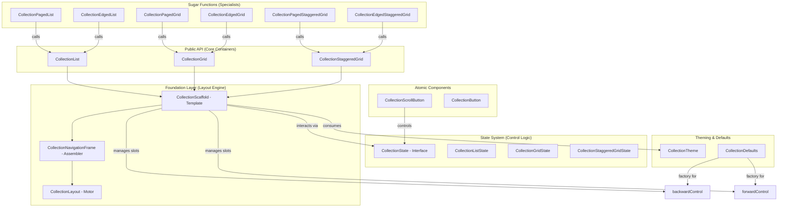

# API Blueprint & Technical Map

This document provides a comprehensive mapping of the `ComposeCollections` library, showing the relationships between its components, states, and internal engine.

## 1. Architectural Hierarchy (Visual)

The library follows a strict layered approach to ensure consistency and reuse.

---

## 2. Functional Matrix

| Component | Paged Mode | Edged Mode | Custom Slots (Slot API) | Hardware Shortcuts | Sticky Headers | Layout Expansion |
| :--- | :---: | :---: | :---: | :---: | :---: | :---: |
| **CollectionList** | ✅ | ✅ | ✅ | ✅ | ✅ | ✅ |
| **CollectionGrid** | ✅ | ✅ | ✅ | ✅ | ✅ | ✅ |
| **CollectionStaggeredGrid** | ✅ | ✅ | ✅ | ✅ | ✅ | ✅ |

> [!NOTE]
> Specialist components (`CollectionPagedList`, etc.) are pre-configured instances of the base containers with `navigationAlignment = Bottom` and the corresponding `mode` enabled.

---

## 3. Package Taxonomy & Responsibilities

### `.collections.layout.list` / `.grid`
- **Goal**: High-level public containers.
- **Organization**: Consolidated files (`CollectionList.kt`, etc.) containing both the generalist engine and specialist "Sugar Functions".

### `.collections.layout.foundation`
- **Goal**: Structural integrity and input orchestration.
- **Responsibility**: `CollectionScaffold` manages the **Slot API Sovereignty** (User controls override library defaults) and maps hardware key events.

### `.collections.state`
- **Goal**: Behavioral logic and scroll control.

### `.collections.components`
- **Goal**: Atomic reusable building blocks.
- **Key Component**: `CollectionScrollButton` - Encapsulates complex visibility and scroll physics.

### `.collections.defaults`
- **Goal**: Global configuration and design tokens.
- **Key Object**: `CollectionDefaults` - Central source of truth for animation specs, expansion policies, and default control factories (`DefaultNavigationControl`).

---

## 4. Slot API Priority & Sovereignty

The library follows a strict precedence rule for UI rendering:

1.  **Direct Sovereignty**: If a Composable is provided to `backwardControl` or `forwardControl`, it is rendered **immediately**, bypassing all library internal logic for that slot.
2.  **Configured Alignment**: If a slot is null, the library checks `navigationAlignment`. If it matches the slot's position, it renders the default control via `CollectionDefaults`.
3.  **Lite Execution**: If the alignment is `None` (default) and no controls are provided, the container renders **zero navigation UI**, acting as a pure performance-enhanced replacement for native `Lazy` components.

---

## 5. Extensibility Map

1. **Total UI Override**: Use `backwardControl/forwardControl`.
2. **Behavioral Switch**: Change `mode` between `Paged` (scroll by viewport) and `Edged` (scroll to extremes).
3. **Physical Feel**: Toggle `animationMode` to switch between `Default`, `Snap` (precise), or `Elastic` (bouncy) scroll physics.
4. **Spatial Footprint**: Use `expandLayout` to switch between a **Tight** container (wraps content) or a **Stretch** container (fills screen).
