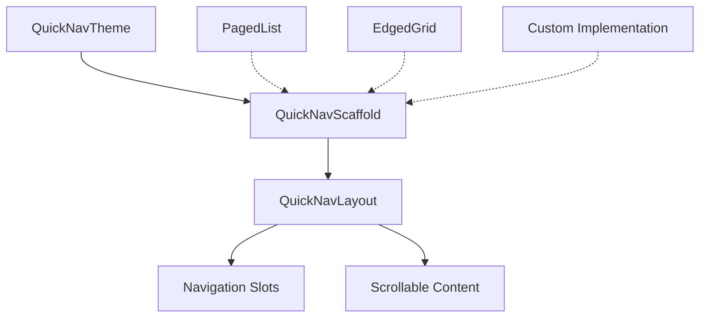

# Library Architecture

`ComposeCollections` is designed with a **Foundation-First** philosophy. This ensures consistent behavior, high performance, and easy extensibility across all scrollable components.

## Core Layers

The library is structured into three main layers:

### 1. The Engine (`QuickNavLayout`)
Located in `.scrollables.layout.foundation`, this is the lowest level of the UI.
- Handles the placement of content and navigation slots.
- Manages two distinct modes: **Stacked** (outside content) and **Overlay** (floating over content).
- Uses `Modifier.weight(1f, fill = false)` and `wrapContent` to ensure the list content dictates the size without stretching deformations.

### 2. The Template (`QuickNavScaffold`)
Also in `.scrollables.layout.foundation`, this acts as a high-level template.
- Injects the `QuickNavTheme`.
- Orchestrates four internal `NavigationRouter` calls to handle all possible button placements (Top, Bottom, Start, End).
- Provides an optional `indicator` slot for visual feedback (e.g., progress bars).
- Bridges the generic layout with specific navigation triggers provided by the state.

### 3. Specialized Components
These are the public APIs developers interact with most:
- **Lists**: `PagedList` and `EdgedList`.
- **Grids**: `PagedGrid` and `EdgedGrid`.
- **Staggered Grids**: `PagedStaggeredGrid` and `EdgedStaggeredGrid`.
- Each component is a "thin wrapper" around the Scaffold, passing its specific scroll state and actions.

## State Management (`QuickNavState`)

We use a **State Hoisting** pattern via the `QuickNavState` interface.
- **Contract-Based**: Components depend on the interface, not concrete implementations.
- **Derived Logic**: Standard implementations (`QuickNavListState`, `QuickNavGridState`, `QuickNavStaggeredGridState`) use `derivedStateOf` to efficiently track scroll position and toggle button visibility without causing global recompositions.

## Component Hierarchy

## Performance Optimization

- **Deferred State Reading**: Navigation visibility is passed as `() -> Boolean` lambdas. This keeps recomposition local to the `AnimatedVisibility` block, preventing the entire list from recomposing while the user scrolls.
- **Stable Actions**: Scroll callbacks are wrapped in `remember(state, scope)` to prevent unnecessary sub-tree invalidations.
- **Hardware Integration**: The Scaffold uses `onPreviewKeyEvent` to intercept and map hardware keys (`PageUp/Down`, `Home/End`) to scroll actions, ensuring high priority over default system behaviors.
- **Internal Protection**: Supporting components (like `NavigationRouter` and navigation panels) are marked as `internal` and hidden in the `.scrollables.internal` package to keep the public API clean and stable.

---

For a detailed mapping of component relationships and functional coverage, check the [API Blueprint & Technical Map](API_MAP.md).
