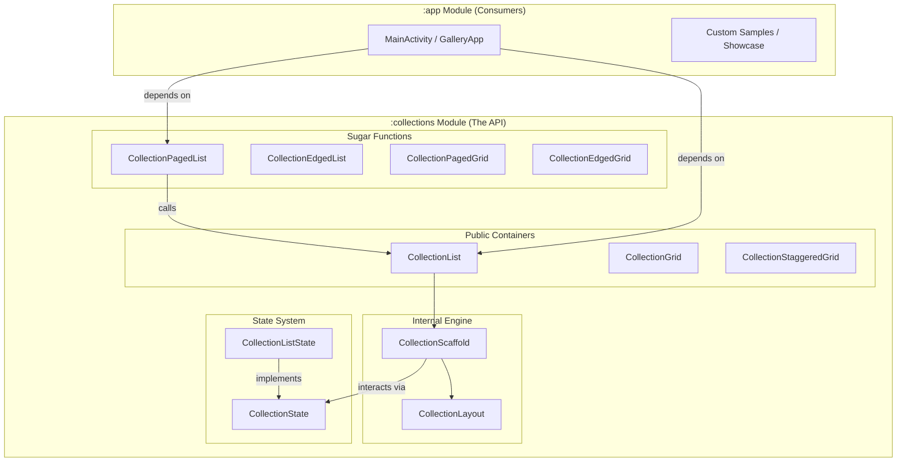

# API Blueprint & Technical Map (v0.2.9)

This document provides a comprehensive mapping of the `ComposeCollections` library, showing the relationships between its components, states, and its new **Multi-Module** architecture.

## 1. Project Structure (Multi-Module)

Since v0.2.9, the project is divided into distinct modules to separate production code from demonstration and test samples.

```text
ComposeCollections (Root)
├── :collections (The Library) 📦
│   ├── /docs (Technical Documentation)
│   └── /src (Production Engine & API)
└── :app (The Gallery/Samples) 🖼️
    └── /src (Showcase & Implementation Examples)
```

## 2. Architectural Hierarchy (Visual)



---

## 3. Functional Matrix

| Component | Paged Mode | Edged Mode | Custom Slots (Slot API) | Hardware Shortcuts | Sticky Headers | Layout Expansion |
| :--- | :---: | :---: | :---: | :---: | :---: | :---: |
| **CollectionList** | ✅ | ✅ | ✅ | ✅ | ✅ | ✅ |
| **CollectionGrid** | ✅ | ✅ | ✅ | ✅ | ✅ | ✅ |
| **CollectionStaggeredGrid** | ✅ | ✅ | ✅ | ✅ | ✅ | ✅ |

---

## 4. Package Taxonomy (inside :collections)

### `.collections.layout.list` / `.grid`
- Consolidated files containing the generalist engine and specialist "Sugar Functions".

### `.collections.layout.foundation`
- `CollectionScaffold` manages **Slot API Sovereignty** and hardware key event mapping.

### `.collections.state`
- Behavioral logic and scroll control via **State Hoisting**.

### `.collections.defaults`
- Central source of truth for design tokens, animation specs, and default factories.

---

## 5. Slot API Priority & Sovereignty

1.  **Direct Sovereignty**: `backwardControl` or `forwardControl` override everything.
2.  **Configured Alignment**: Library renders defaults if `navigationAlignment` is set.
3.  **Lite Execution**: `None` alignment + No controls = zero UI overhead (Standard `Lazy` behavior).
