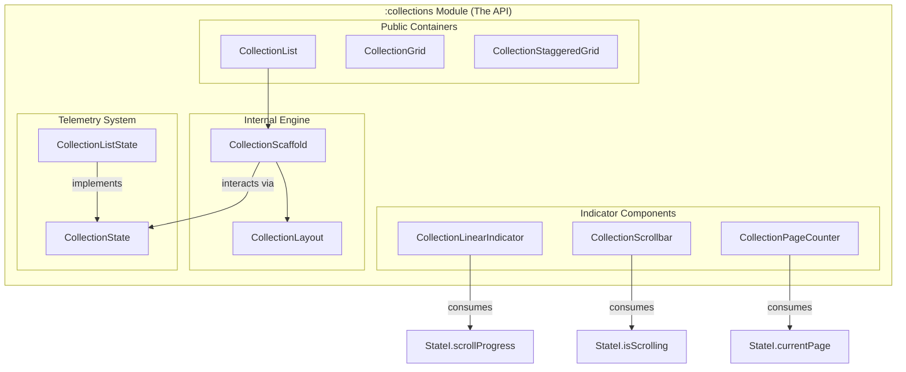

# API Blueprint & Technical Map (v0.2.10)

This document provides a comprehensive mapping of the `ComposeCollections` library, showing the relationships between its components, states, and its **High-Precision Telemetry** system.

## 1. Project Structure (Multi-Module)

```text
ComposeCollections (Root)
├── :collections (The Library) 📦
│   ├── /docs (Technical Documentation)
│   └── /src (Production Engine & API)
└── :app (The Gallery/Samples) 🖼️
    └── /src (Showcase & Implementation Examples)
```

## 2. Architectural Hierarchy (Visual)



---

## 3. Functional Matrix

| Component                   | Paged Mode | Edged Mode | Precision Telemetry | Modern Scrollbar | Page Counter | Hardware Shortcuts |
|:----------------------------|:----------:|:----------:|:-------------------:|:----------------:|:------------:|:------------------:|
| **CollectionList**          |     ✅      |     ✅      |   ✅ (Pixel-level)   |        ✅         |      ✅       |         ✅          |
| **CollectionGrid**          |     ✅      |     ✅      |   ✅ (Pixel-level)   |        ✅         |      ✅       |         ✅          |
| **CollectionStaggeredGrid** |     ✅      |     ✅      |   ✅ (Pixel-level)   |        ✅         |      ✅       |         ✅          |

---

## 4. Telemetry API (`CollectionState`)

Since v0.2.10, the library provides industrial-grade telemetry:

- **`scrollProgress`**: Calculated based on cumulative pixel offsets, not item counts. Accurate for variable-sized items.
- **`isScrolling`**: Reactive boolean to track movement (perfect for hiding/showing scrollbars).
- **`currentPage` / `totalPages`**: Smart estimation based on average item size and viewport coverage.

---

## 5. Indicator Sovereignty

The library provides three ways to visualize progress:

1.  **Linear (Integrated)**: Enabled via `showIndicator = true`.
2.  **Scrollbar (Modern)**: Discretely appears on the edge during movement.
3.  **Counter (Textual)**: Floating "pill" showing the exact page location.

---

## 6. Extensibility Map

1. **Total UI Override**: Use `backwardControl/forwardControl`.
2. **Behavioral Switch**: Change `mode` between `Paged` and `Edged`.
3. **Physical Feel**: Toggle `animationMode` (Default, Snap, Elastic).
4. **Telemetry Visualization**: Inject any of the new `Indicator` components into custom slots or overlays.
